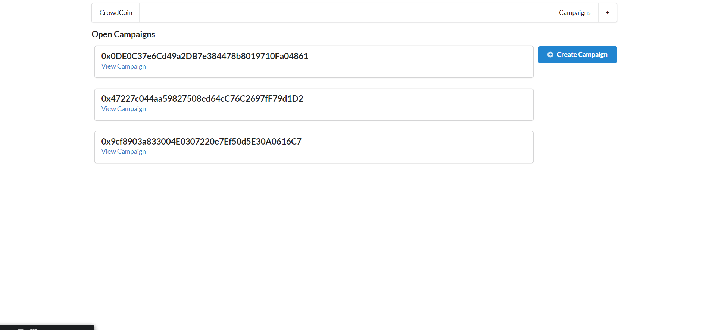

# Ethereum-CrowdCoin

 Ethereum, Solidity, and Smart Contracts to build production-ready apps based on the blockchain. Crowd Coin is an app that utilizes ethereum for donations. Users can view campaigns and donate using their Metamask accounts.
 
 ## Metamask Required
 
 Set up and connect your Metamask account
 
 [Metamask](https://metamask.io/)
 
 ## Installation
 
 ```
 npm install next-routes --legacy-peer-deps
 
 ```
 
 
 
 ## Contributor
 Erik Williams
